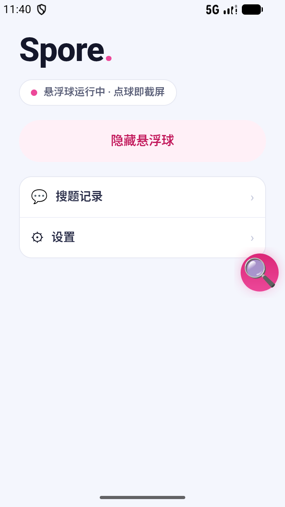
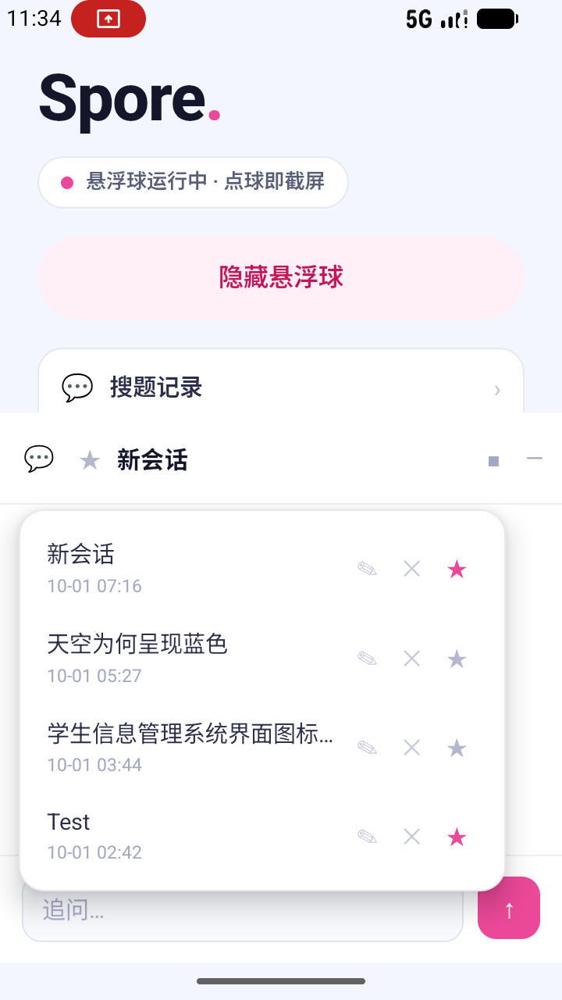
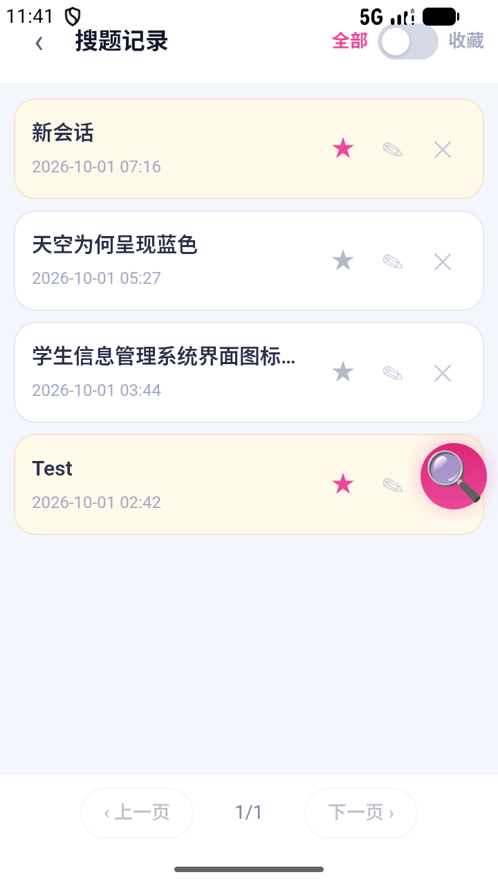

# The Real Spore is Mobile.

> **The Real Spore is Mobile.** The Android counterpart of [Spore](https://github.com/Offblink/Spore), the Chromium
> **Manifest V3** screenshot-Q&A extension: tap the floating ball, box the question on your screen, get a fast answer
> that verifies itself online. 本项目是**移动应用开发 的课设项目**。

<p align="center">
  
</p>

**Spore 孢子 · 截图问答的手机版**：屏幕上出现一道题 → 点一下悬浮球 → 框选 → 抽屉面板里
**先快答，再联网核实**，答完流式回给你。

## 与 MV3 版的关系

**MV3 版** = [Offblink/Spore](https://github.com/Offblink/Spore)：一个零构建的 Chromium/Edge
**Manifest V3 扩展**，`Alt+S` 框选网页截图 → 屏幕右缘弹抽屉 → 先快答再核实。
**本项目 = 同一个 Spore 搬到手机上**，不是另一个产品。

| | [Spore（MV3 版）](https://github.com/Offblink/Spore) | **Spore-Mobile（本项目）** |
|---|---|---|
| 形态 | 浏览器扩展（Manifest V3，装上就能用） | Android 原生 App（Java + XML Views） |
| 取图 | `Alt+S` 冻结视口后框选网页 | 悬浮球点一下 → `MediaProjection` 取帧 → 冻结帧框选 |
| 界面 | 网页右缘抽屉 +「搜题记录」整页 | 同款抽屉面板 + 同款搜题记录页（WebView 皮 / 原生皮） |
| 存档 | 扩展本地存档 | `filesDir/sessions/<id>.json`，两边**不互通** |

三条对齐口径：

- **交互逐条对齐**：💬 会话列表、★ 收藏（**只标记、不置顶**）、✎ 重命名、✕ 删除确认框、
  流式回答与「思考」块、随时可调检索工具的追问、全部/收藏筛选 + 分页的搜题记录页、点图放大并保存到相册。
- **作答内核是移植的**：阶段 A 直答 → 阶段 B 联网核实的两阶段协议、`<<ok>>` 自评跳过核实、
  「答案与解析必须同向」的极性自检 —— 逐语义移植自 MV3 版 `src/lib/agent.js`
  （本项目 `app/src/main/java/org/offblink/spore/agent/Phases.java`，两边字段与分支一一对应）。
- **数据各存各的**：桌面扩展和手机 App 不共享会话。

一句话：**MV3 版是放在电脑里的 Spore，这个是揣在兜里的那个。**

## 这是一门课的课设项目

本项目是**移动应用开发 的课设项目**，按课程约束实现：

- **Java + XML Views + Material Components**，不使用 Kotlin、不使用 Jetpack Compose；
- 单模块 `app`，包名 `org.offblink.spore`，`minSdk 26` / `targetSdk 37` / Java 11；
- 关键链路自己接，不靠框架兜底：
  `MediaProjection` 取帧 → `ImageReader` 出位图 → ML Kit 中文文字识别（16.0.1）→
  黑帧/画质自检 → 裁剪落盘（长边 1600、JPEG 0.82）→ `WebView` 面板 + `addJavascriptInterface` 桥 →
  本地 JSON 会话存档 + 前台服务悬浮球。

## 安装与用法

1. 到 [Releases](https://github.com/Offblink/Spore-Mobile/releases) 下 `Spore-debug.apk`
   （2026-10-01 构建，51.6 MB），允许「安装未知应用」后安装。
2. 首次打开 → 点「显示悬浮球」→ 授予**悬浮窗**权限；再按提示授予**屏幕录制**权限。
3. 日常：
   - **点球** = 截屏取帧 → 框选题目 → 面板里看答案；
   - **长按球** = 开 / 关面板；
   - 抽屉里 💬 开会话列表、★ 收藏、✎ 改名、✕ 删除；底部输入框随时追问；
   - 「搜题记录」页翻历史、按收藏筛选、点图放大 → 保存到相册（`Pictures/Spore`）。

## 截图

| 主页与悬浮球 | 抽屉与会话列表 | 搜题记录页 |
|---|---|---|
|  |  |  |

> AVD（Small_Phone）实拍，2026-10-01。

## 权限都干什么

| 权限 | 用途 |
|---|---|
| 显示在其他应用上层（悬浮窗） | 悬浮球与回答面板浮在别的 App 上 |
| 屏幕录制（`MediaProjection`） | 点球取当前屏幕的帧 —— 这是本 App 拿到题目的唯一方式 |
| 前台服务 + 通知 | 悬浮球常驻，被系统回收就再也截不了屏（`FGS` 类型 `mediaProjection`） |
| 相册写入 | 「保存到相册」把截图存进 `Pictures/Spore` |

API Key 只存在本机设置页（不进 git、不进日志）；会话、截图都留在应用私有目录里。

## 从源码构建与验证

```bash
git clone https://github.com/Offblink/Spore-Mobile.git
cd Spore-Mobile
./gradlew assembleDebug            # Windows: gradlew.bat assembleDebug
./gradlew testDebugUnitTest        # 单测
```

- 产物：`app/build/outputs/apk/debug/app-debug.apk`。
- 2026-10-01 实测：`assembleDebug testDebugUnitTest` **23/23 全绿**
  （FrameQuality 7 · Phases 7 · Suggest 6 · LlmClient 3），APK **51,610,314 B**。
- 工程自带 Gradle wrapper **9.5.0**，需要 Android SDK（`compileSdk release(37)`）。

## 已知问题

- 部分真机上点球可能取到**整屏偏黑**的帧（`MediaProjection` 出帧侧问题，App 会自检并提示
  「截到黑屏（对方可能禁止截屏），已取消」，同时在 `files/diag/` 留下诊断样本）；
  AVD 上未复现，仍在排查。

## License

[MIT](LICENSE)
